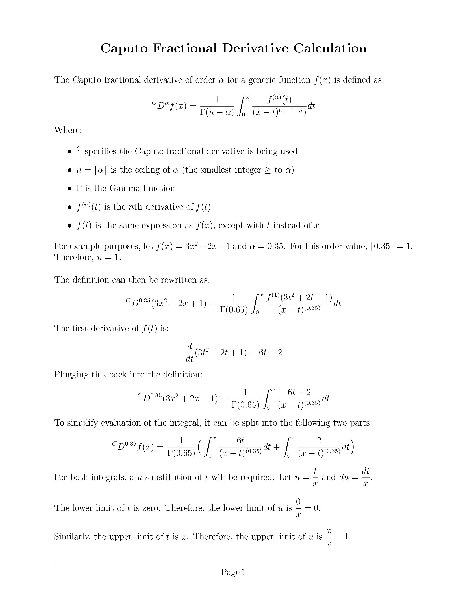
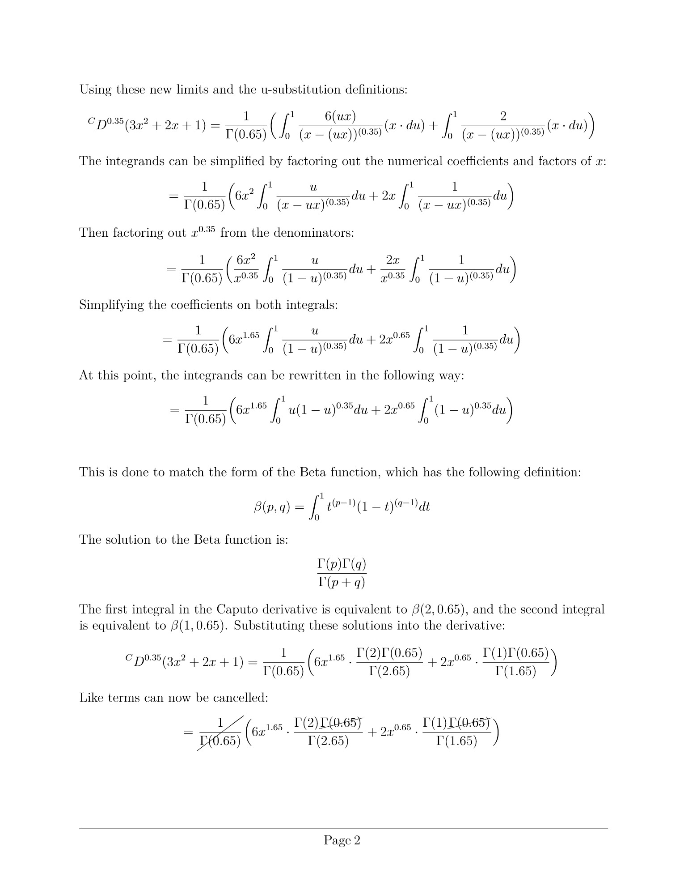
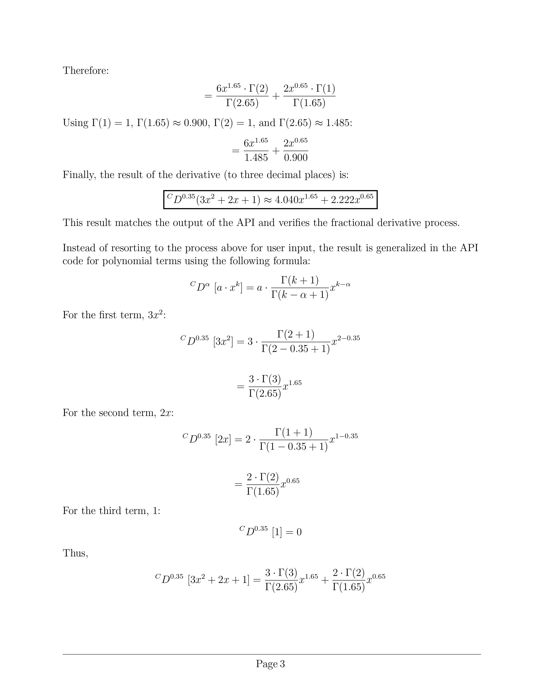
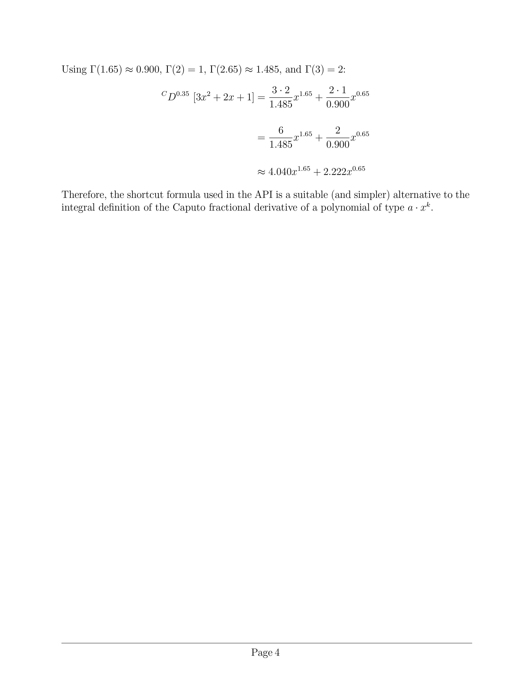

<!-- @formatter:off -->
# Fractional Calculus Computation API

This is a Java-based API that can produce expressions for derivatives and integrals of
user-submitted expressions of integer or fractional order.


<br/>

## Table of Contents

[Project Status](#project-status)  
[Technologies Used](#technologies-used)  
[Getting Started](#getting-started)
[Endpoint Information](#endpoint-information)  
[Examples](#examples)  
[Calculation Details](#calculation-details)  
[FAQ](#faq)  
[Contributing](#contributing)  
[Changelog](#changelog)  
[Known Issues](#known-issues)  
[License](#license)  
[Acknowledgements](#acknowledgements)  
[Support](#support)


<br/>

## Project Status

This project is in active development with a current version of 1.0.0.  
Upcoming features include:

- Support for other types of expressions (logarithms, trig identities, etc.)

- Support for mixed expressions

- Support for nested functions

- Frontend UI

<br/>

## Technologies Used

### Core Technologies

- **Java**: OpenJDK Version 22.0.1

### Build Tools

- **Maven**: Version 3.9.6

### Frameworks

- **Spring Boot**: Version 3.2.5
- **Spring MVC**: Version 6.1.6

### Testing

- **JUnit**: JUnit 5 (JUnit Jupiter) Version 5.10.2
- **Mockito**: Version 5.11.0

### Libraries

- **Apache Commons Math**: Version 3.6.1
- **Jackson Databind**: Version 2.15.4
- **Logback**: Version 1.4.14
- **SLF4J**: Version 2.0.13
- **Hibernate Validator**: Version 8.0.1.Final

<br/>

## Getting Started

Clone the repository:

```sh
git clone https://github.com/trbaxter/fractional-computation-api.git
```

<br/>


Navigate to the project directory:

```sh
cd fractional-computation-api
```

<br/>


Build the project using Maven:

```sh
mvn clean install
```

<br/>

Start the application using the following command:

```sh
mvn spring-boot:run
```

<br/>

Upon successful start, endpoints may be accessed by using cURL commands or API testing software.

<br/>

## Endpoint Information

<details>
<summary><strong>
Caputo Fractional Derivative
</strong></summary>
<br/>

<table>
<tr>
<td>

HTTP Verb: **POST**  
URL: `/fractional-calculus-computation-api/derivative/caputo`

Required request body:

```json
{
  "coefficients": [],
  "order": ""
}
```

`coefficients` - An array of polynomial coefficients of type double or integer.  
`order` - Operation order value. Can be integer, zero, or non-integer of type double.

API Response:

```json
{
  "expression": ""
}
```

Returns the closed-form expression of the Caputo fractional derivative if successful.
</td>
</tr>
</table>
</details>

<br/>

<details>
<summary><strong>
Riemann-Liouville Fractional Derivative
</strong></summary>
<br/>

<table>
<tr>
<td>  

HTTP Verb: <b>POST</b>  
Endpoint URL: `/fractional-calculus-computation-api/derivative/riemann-liouville`

Required request body:

```json
{
  "coefficients": [],
  "order": ""
}
```

`coefficients` - An array of polynomial coefficients of type double or integer.  
`order` - Operation order value. Can be integer, zero, or non-integer of type double.

API Response:

```json
{
  "expression": ""
}
```

Returns the closed-form expression of the Riemann-Liouville fractional derivative if successful.

</td>  
</tr>
</table>
</details>

<br/>

<details>
<summary><strong>
Caputo Fractional Integral Endpoint
</strong></summary>
<br/>

<table>
<tr>
<td>

HTTP Verb: <b>POST</b>  
Endpoint URL: `/fractional-calculus-computation-api/integral/caputo`

Required request body:

```json
{
  "coefficients": [],
  "order": ""
}
```

```coefficients``` - An array of polynomial coefficients of type double or integer.  
```order``` - Operation order value. Can be integer, zero, or non-integer of type double.

API Response:

```json
{
  "expression": ""
}
```

Returns the closed-form expression of the Caputo integral if successful.
</td>
</tr>
</table>
</details>

<br/>

## Examples

<details>
<summary><strong>
0.35724th Caputo Fractional Derivative of 4.27x² + 2.016x + 1
</strong></summary>
<br/>

<table>
<tr>
<td>

Input:

```json
{
  "coefficients": [4.27, 2.016, 1],
  "order": "0.35724"
}
```

API Output:

```json
{
  "expression": "5.782x^1.64276 + 2.242x^0.64276"
}
```

</td>
</tr>
</table>
</details>

<br/>

<details>
<summary><strong>
3.14159th Riemann-Liouville Fractional Derivative of 3x² + 2x + 1
</strong></summary>
<br/>

<table>
<tr>
<td>

Input:

```json
{
  "coefficients": [3, 2, 1],
  "order": "3.14159"
}
```

API Output:

```json
{
  "expression": "-0.769x^-1.14159 + 0.293x^-2.14159 - 0.313x^-3.14159"
}
```

</td>
</tr>
</table>
</details>

<br/>

<details>
<summary><strong>
1.79th Caputo Fractional Integral of 3x³ - x + 12
</strong></summary>
<br/>
<table>
<tr>
<td>

Input:

```json
{
  "coefficients": [3, 0, -1, 12],
  "order": "1.79"
}
```

Output:

```json
{
  "expression": "0.214x^4.79 - 0.216x^2.79 + 7.218x^1.79 + C"
}
```

</td>
</tr>
</table>
</details>


<br/>

## Calculation Details

<details>
<summary>
Caputo Fractional Derivative of 3x² + 2x + 1 using $\alpha$ = 0.35 (full derivation process)
</summary>
<br/>






</details>

<br/>

## FAQ

<details>
    <summary>&nbsp;<i>What is a fractional derivative?</i></summary>&nbsp;<br/>
    A fractional derivative is a generalization of the traditional integer-order derivative extended 
    to include non-integer values.
</details>

<br/>

<details>
    <summary>&nbsp;<i>Why is this important?</i>&nbsp;<br/></summary>&nbsp;<br/>
    This type of analytical technique is particularly useful for investigating or modeling physical phenomena 
    that exhibit memory effects or hereditary properties in its behavior.
</details>


<br/>

<details>
    <summary>&nbsp;<i>What is meant by "memory effects"?</i></summary>&nbsp;<br/>
    "Memory effects" refers to how a system's <i><b>recent</b></i> past influences its present behavior. <br/> 
    In other words, the system "remembers" its recent history. <br/><br/>
    For example, consider a rubber band that's been stretched and released multiple times. 
    The current "stretchiness" of the rubber band not only depends on how it's being stretched right now, but 
    <i><b>also</b></i> on how it was stretched recently.
</details>

<br/>

<details>
    <summary>&nbsp;<i>What about "hereditary properties"?</i></summary>&nbsp;<br/>
    "Hereditary properties" refers to the characteristics of a system that depend on its <i><b>entire</b></i> history. 
    <br/><br/>
    As an example, consider a material that hardens over time, like concrete. The current "hardness" of concrete is a 
    comprehensive function of its entire history - the starting mix ratio of cement and water, the curing conditions, 
    the amount of cumulative elemental exposure - all of these historical factors represent the hereditary properties 
    of the material.
</details>

<br/>

<details>
    <summary>&nbsp;<i>How does all this relate to the Caputo and Riemann-Liouville derivatives?</i></summary>&nbsp;<br/>
    These two derivatives give us an option to select how much of a system's "memory" we wish to consider in 
    the mathematical analysis of a given phenomena. <br/><br/>
    If only a portion of a system's "memory" is needed, then the Caputo derivative is used. <br/>
    If the entire system's "memory" is needed, then the Riemann-Liouville derivative is used. 
</details>

<br/>

<details>
    <summary>&nbsp;<i>There are multiple coefficients in my input, but the output doesn't show the same amount. Why?</i>
    </summary>&nbsp;<br/>
    There are two reasons why this occurs:&nbsp;<br/><br/>
    <details>
        <summary>&nbsp; Fractional Derivatives of Constants</summary>&nbsp;<br/>
        For an array with multiple coefficients, the right-most coefficient represents a constant term, and the 
        fractional derivative of a constant is always zero for a Caputo fractional derivative. <br/><br/>
        If the fractional derivative of a constant is needed, use the Riemann-Liouville option.
    </details> <br/>
    <details>
        <summary>&nbsp; General Behavior of a Caputo Derivative</summary>&nbsp;<br/>
        For a Caputo derivative, if the exponent value of the term minus the order value is a negative number, then that 
        term's calculation will be omitted from the result. This is due to the way in which the Caputo derivative is 
        designed to handle "well-behaved" finite functions. 
        <br/><br/>
        Consider the following example where $f(x) = x$ and $\alpha = 2$: <br/><br/>
        ${}^{C} D^{2}{\text{&nbsp;}}[x] = \dfrac{\Gamma(2)}{\Gamma(2-2)}x^{1-2} = \dfrac{1}{\Gamma(0)}x^{-1}$
        <br/><br/>
        Since $\Gamma(0)$ is undefined, this result would be omitted from the output expression. 
        <br/>
        This applies to negative values of the gamma function as well.
    </details>
</details>

<br/>

<details>
    <summary>&nbsp;<i>Why are there two derivative endpoints, but only one integration endpoint?</i></summary>&nbsp;<br/>
    This is because the Caputo and Riemann-Liouville techniques treat derivatives of constant values differently.
    <br/>
    <br/>
    This distinction is not present in the API integration process, and both methods lead to the same results.<br/>
</details>


<br/>

## Contributing

Contributions towards this project are welcome! If interested, please follow these steps:

1.) Fork the repository

2.) Create a new branch (`git checkout -b feature-branch`)

3.) Commit your changes (`git commit -m 'Add some feature'`)

4.) Push to the branch (`git push origin feature-branch`)

5.) Open a pull request

Remember to update tests if necessary and provide responses to the questions as outlined in the
pull request template.

<br/>

## Changelog

### Version [1.0.0] - Released 2024-06-TBD

- Initial release with Caputo and Riemann-Liouville fractional derivative and Caputo fractional
  integration capabilities


- Includes comprehensive test coverage

<br/>

## Known Issues

- When polynomial coefficients are very large, or very small, numerical precision errors may
  occur.


- The current implementation does not support multi-threading for large-scale computations.

<br/>

## License

This project is licensed under the MIT License. See the LICENSE file for details.

<br/>

## Acknowledgements

- <a href="https://spring.io/projects/spring-boot">Spring Boot</a>


- <a href="https://maven.apache.org/">Maven</a>


- <a href="https://commons.apache.org/proper/commons-math/">Apache Commons Math</a>


- <a href="https://openai.com/">OpenAI GPT-4o</a>

<br/>

## Support

For any questions or assistance, please reach out to the project creator.