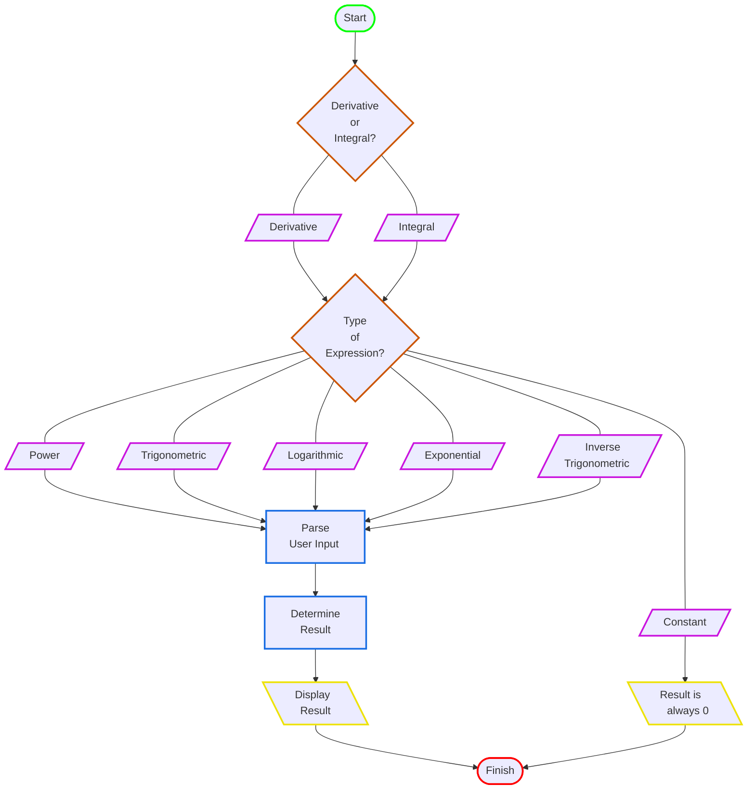
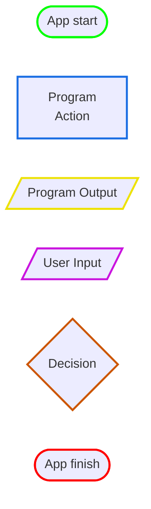

# Fractional Calculus Computation API (in progress)

## Overview

This is a computational API that calculates derivatives or integrals using fractional
calculus techniques.  
  
At the moment, the API supports valid responses for _integer-order polynomial expressions_.  
(e.g. 4x³ + 0.5x² + 12x - 15)
  

## Background

With ordinary calculus, the number of times we differentiate or integrate a function is typically referred to as the 
_**order**_ of the operation. This order value is restricted to positive integers only.

Fractional calculus is not bound to this restriction; we are free to take the 4.687-th integral of a function, or the 
π-th derivative if we wish. This grants a much greater precision with which we can analyze the behavior of complex 
physical systems.
  
 

## Real-World Applications of Fractional Calculus

Below is a small sample of academic papers utilizing fractional calculus techniques for analysis of various phenomena:

- Conservation of mass in fluid flow [Wheatcraft and Meerschaert (2008)]
- Analysis of groundwater flow [Atangana et al. (2013-2014)]
- Modeling viscoelastic dampening in polymer materials [Mainardi (2010)]
- Propagation of acoustical waves in complex media (biological tissue) [Holm & Näsholm (2011)]
- Expanding the solution of the Schrödinger equation in quantum mechanics [Bhrawy & Zaky (2017)]

   
  
## How The Derivatives Are Calculated

In the subsections below, $D$ is the shorthand notation for the differentiation operator, and $\alpha$ represents the 
order value of the differentiation. When applied to a variable, such as $x$, it means:
  
$$
D^{α}(x) = \dfrac{d^{α}}{dx^{α}}(x)
$$  

For example, $D^{2}(x^{3}) = 6x$. 

 

### Constants

Let $c$ represent a constant. The factional derivative of a constant is defined as:
  
$$
D^{α}(c) = 0
$$  
  
This is no different from integer-order derivatives of constant values.  
  
 

### Power Expressions

Let $k$ represent a constant value. The fractional derivative of a power expression can be expressed, in general, as:  

$$
D^{α}(x^{k}) = \dfrac{Γ(1+k)}{Γ(1+k-α)} x^{k - α}
$$  

Where $x ≥ 0, k ≠ -1, -2, -3 ...$ and $\Gamma$ is the Gamma function, defined for $n > 0$ as:  

$$
Γ(n) = (n-1)!
$$

This extends to polynomial expressions consisting of multiple terms of varying powers. 

 

[//]: # (&#40;Plan on rewriting these using LaTeX&#41;:)

[//]: # ()
[//]: # (1.&#41; D^α&#40;x&#41; &#40;e^&#40;kx&#41;&#41; = k^α e^&#40;kx&#41;)

[//]: # ()
[//]: # (2.&#41; D^α&#40;x&#41; &#40;sin&#40;kx&#41;&#41; = k^α sin&#40;kx + απ/2&#41;)

[//]: # ()
[//]: # (3.&#41; D^α&#40;x&#41; x^k = Γ&#40;1+k&#41;/Γ&#40;1+k-α&#41;)

[//]: # ()
[//]: # (For 1 and 2, k >= 0.)

[//]: # (For 3, x >= 0, and K is an element of the positive integers &#40;including zero&#41;.)

## High-level Design Diagram

## Diagram Legend

